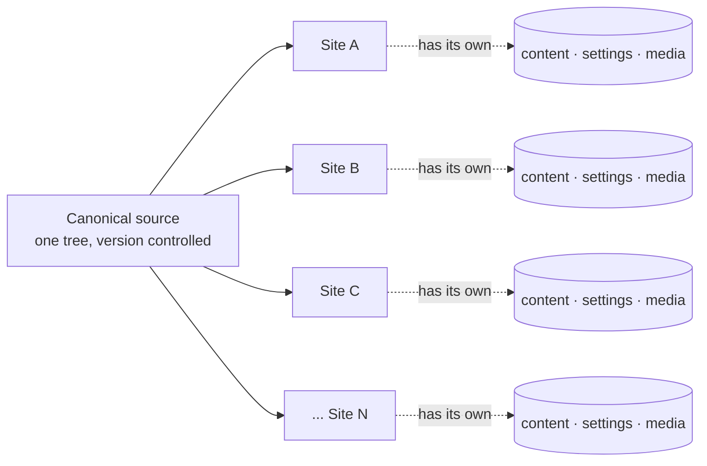
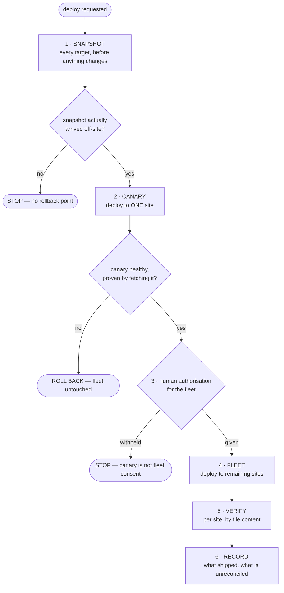
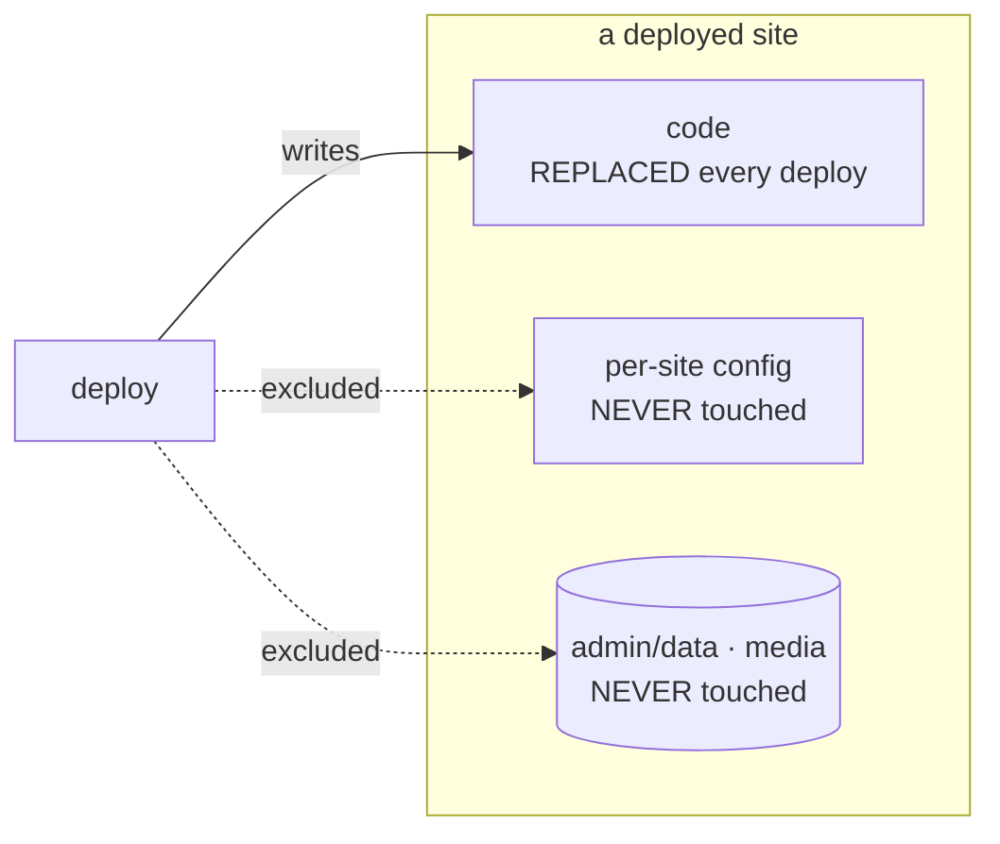
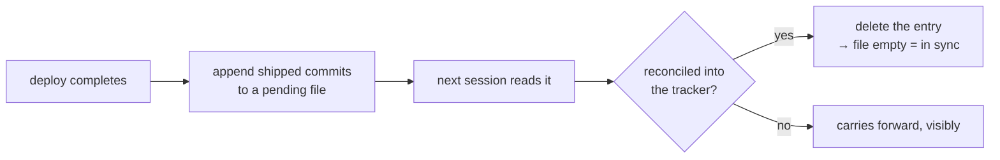

<!-- doc-version: 1.1.0 | cut: 2026-08-31T00:29Z | src-commit: b87605e | doc: DEPLOY-ARCHITECTURE -->

# Fleet Deployment — Architecture

**How to build a deployment system for a fleet of Luminal Open CMS sites.**

**Doc version 1.1.0 · cut 2026-08-31T00:29Z**

---

## Idea vs. implementation — read this first

**This document describes an architecture. It is not our deployment code, and it deliberately
contains none of it.**

That is not evasiveness, it is the useful boundary. Our implementation is welded to our own
topology — specific hosts, specific domains, specific storage remotes. Handed to you it would be
a thing to *un-pick* before it was a thing to use. The architecture, on the other hand, transfers
whole.

So this is written at the level a competent engineer — or a capable coding agent — can build from:
the shape, the invariants, and **the failure that produced each invariant.** The failures are the
valuable part. Anyone can design the happy path; the rules below are the scar tissue from two
years of running a real fleet, and most of them are counter-intuitive until they bite you.

If you are handing this to an agent: the section *"Building this"* at the end is written for that.

---

## 1. The problem

One codebase. Many sites. Each site has its own content, its own settings, its own uploaded media
— none of which the codebase knows about, and all of which is the customer's actual business.

A deploy must replace **code** on every site without touching **content** on any of them. And it
must do that without a human checking forty sites by hand afterward.

The entire design follows from one observation: **the dangerous direction is deletion, not
addition.** A file wrongly added is noise. A file wrongly removed is a customer's business gone.

## 2. The shape

Each numbered stage exists because skipping it caused a specific incident. Sections 3–8 are those
stages, and what each one is really defending against.

## 3. Snapshot — and prove it landed

Take a backup of every target *before* the first byte changes, and store it somewhere the deploy
cannot reach.

**The invariant: verify the snapshot ARRIVED. Not that the snapshot command exited 0.**

> **The failure.** A site's off-site code backup was, for twenty days, simply gone. Nothing
> malfunctioned. The retention policy purged archives older than fourteen days, exactly as
> designed. The backup job, finding its upload credential stale, aborted cleanly rather than
> shipping a corrupt empty archive — also exactly as designed. **Two correct systems, composed,
> destroyed the backup.** The job "succeeded" at doing nothing, on schedule, for weeks.

Consequences for your design:

- Check for the **artifact**, not the exit status: does a file of plausible size exist, at the
  expected remote path, with today's stamp?
- **Never let retention delete the newest copy in a tier**, however old it is. An expiry rule that
  can reach zero surviving copies is a data-loss rule wearing a maintenance costume.
- Ask *"did a backup arrive?"* as a separate monitor from *"did the job fail?"*. Those are
  different questions and only the first one is about your data.

## 4. Additive deploy — the operator's files are sacred

A deploy writes and overwrites. **It does not delete**, except in narrowly enumerated places where
removal is the actual intent (retiring a module, say) — and that scope should be small enough to
state in one sentence.

Some files must never be overwritten at all: per-site configuration, and anything the operator is
expected to hand-edit. Treat these as a declared exclusion set.

⚠️ **The subtle one: an unserved directory is not an untouched directory.** We found a site
directory with no web server entry — unreachable, effectively dead — that fleet deploys were still
faithfully writing into. If a path is in the target list, it is live as far as the deploy is
concerned, whatever the web server thinks.

## 5. Canary — and the canary must be able to fail

Deploy to exactly one site first. Prove it healthy by **fetching pages over the network** — not by
reading the deploy's own log.

> **The failure.** A security cutover used a canary URL to prove the new configuration was live.
> It returned the expected result — and would have returned that same result under the *old*
> configuration too, because both set it. The control could not distinguish success from rollback.
> It was, in the exact sense, a test that always passed.

**A check that cannot fail is not a check.** Before trusting any probe, make it fail on purpose
once and watch it report failure. Where a probe proves "the new thing is live", have the new thing
stamp its own identity into the response, so the probe distinguishes *this* build from *any*
build.

## 6. Authorisation — the canary is not consent

A successful canary authorises nothing beyond the canary. Fleet-wide deployment is a separate,
explicit human decision.

This is a process invariant, not a technical one, and it is worth encoding: make the fleet step
require an unambiguous affirmative that cannot be produced by an automation that lost its way.

⚠️ Related: if your confirmation prompt cannot read an answer — piped input, no terminal, a
timeout — it must **fail closed**. A prompt that proceeds on silence is not a prompt, and a prompt
that *exits successfully having done nothing* is worse: the operator is told the deploy is done.

## 7. Verify by file, never by exit code

After the fleet step, prove per site that the intended content is actually there — hash a changed
file and compare against the source.

> **The failure, repeatedly.** Deploy tooling reported success while doing nothing. A verification
> loop that shelled out to each host consumed the loop's own input stream and exited after one
> iteration — reporting *"1 match, 0 mismatch, of 1 targets"*, which reads exactly like a pass. A
> comparison whose expression silently errored marked every site OK. A green check that cannot go
> red is indistinguishable from a broken one.

So: **check the check.** When a verification reports a clean sweep, confirm it examined the number
of things you expected it to examine. Count, then compare the count.

## 8. Record what is unreconciled

After a deploy, append what shipped to a file whose *emptiness* is the healthy state. At the start
of the next session, that file either is empty or tells you what is outstanding.

The property that matters: **the default state is loud.** Anything unreconciled stays visible
until a human resolves it, rather than aging quietly into forgotten.

## 9. The failure mode underneath all of these

Every incident above is the same bug wearing different clothes: **something reported success while
doing nothing.**

- A backup job that aborted cleanly and logged success.
- An enforcement mode that enforced nothing but announced itself as enforcing.
- A canary that passed under both configurations.
- A verification loop that checked one item and reported a clean sweep.
- A guard that failed on every invocation, so its warning became background noise.

When you build this, spend your effort disproportionately on **making success hard to claim.**
Every "✓ complete" your tooling prints should be traceable to a fact it actually measured. Print
the number it counted, not the word "done".

Corollary worth internalising: **a guard that always passes and a guard that always fails are the
same bug.** Both convey no information; only one of them looks broken.

## 10. Building this

### Hand this to your agent

Paste the following, then attach this document:

> Build me a deployment system for a fleet of Luminal Open CMS sites, following the attached
> architecture document. My setup: `<describe your servers, how many sites, where backups go, how
> you reach each host>`.
>
> Work through the seven steps in section 10 in order. After each one, tell me how I would know if
> that step silently did nothing — and if you cannot answer that, the step is not finished.
>
> Treat every invariant in sections 3–8 as a requirement, not a suggestion. Each one exists
> because skipping it destroyed something real.

The document is written to be implemented from. It contains no code on purpose: the invariants
transfer to any infrastructure, an implementation does not.

### The order

If you are directing an agent, this is the useful order — each step ends in something observable:

1. **Target list from one source of truth.** Derive it; never maintain a second copy. Two lists
   drift, and the drift is invisible until a site is deployed-to but not backed-up. Make the tool
   able to *print* its resolved targets and do nothing, so coverage is checkable before a deploy
   rather than discovered after one.
2. **Snapshot, with arrival verification.** Fail loudly when targets can't be determined — never
   quietly back up a narrower set and report success.
3. **Additive file sync**, with the exclusion set declared in one place.
4. **A canary probe that stamps identity**, and which you have watched fail.
5. **The fleet step, gated on explicit authorisation**, failing closed on ambiguity.
6. **Per-site verification by content hash**, reporting counts.
7. **The unreconciled record**, whose empty state means in-sync.

At each step, ask the question this document keeps circling: *how would I know if this silently
did nothing?* If you cannot answer, that step is not finished.

---

## What is deliberately not here

No source code, no host names, no network topology, no credential handling specifics. This is the
architecture, which transfers; the implementation is ours, is shaped by our particular fleet, and
would cost you more to adapt than to write.

Build it for your topology. The invariants are the transferable part — and they were expensive.
